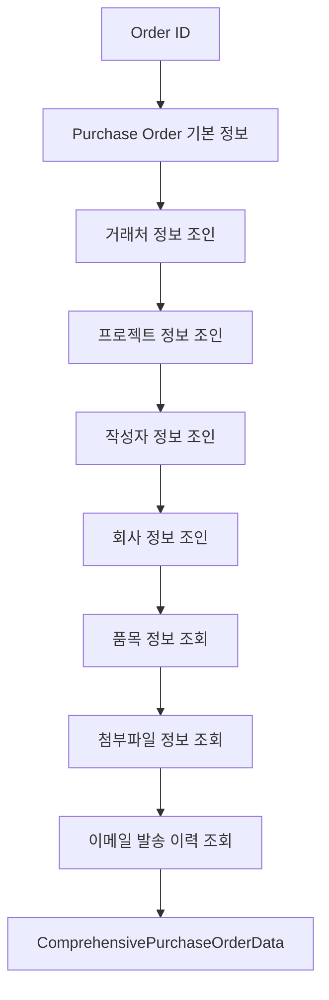

# Professional PDF Generation System

전문적인 구매 발주서 PDF 생성 시스템으로, 데이터베이스의 포괄적인 정보를 활용하여 정보 집약적이고 컴팩트한 발주서를 생성합니다.

## 🎯 주요 개선사항

### 현재 PDF vs 전문적 PDF 비교

| 기능 | 현재 PDF | 전문적 PDF |
|------|----------|-------------|
| **레이아웃** | 기본적, 여백 많음 | 컴팩트, 정보 집약적 |
| **회사 정보** | 최소한의 정보 | 완전한 비즈니스 정보 |
| **거래처 정보** | 간단한 세부사항 | 포괄적인 거래처 프로필 |
| **프로젝트 정보** | 기본 정보 | 타임라인과 함께 완전한 세부사항 |
| **품목 분류** | 단순 목록 | 3단계 계층 구조 (대/중/소분류) |
| **금액 정보** | 총 금액만 | 소계, 부가세, 합계 구분 |
| **계약 조건** | 없음 | 결제/납품/품질 조건 |
| **커뮤니케이션** | 없음 | 첨부파일 및 이메일 이력 |
| **승인 워크플로우** | 기본 서명란 | 완전한 결재 현황 |
| **법적 정보** | 기본 회사 정보 | 전문적인 법적 고지사항 |

## 🏗️ 아키텍처

### 핵심 컴포넌트

1. **ProfessionalPDFGenerationService**: 메인 PDF 생성 서비스
2. **ComprehensivePurchaseOrderData**: 포괄적인 데이터 모델
3. **Professional HTML Template**: 정보 집약적 HTML 템플릿
4. **PDFKit Integration**: Vercel 호환 직접 PDF 생성

### 데이터 수집 흐름



## 🚀 사용 방법

### Backend API

#### 1. 전문적 PDF 생성
```http
POST /api/orders/:id/generate-professional-pdf
Authorization: Bearer <token>
```

**응답:**
```json
{
  "success": true,
  "message": "전문적 발주서 PDF가 성공적으로 생성되었습니다",
  "attachmentId": 123,
  "pdfPath": "professional://PO_Professional_PO-2025-00001_1704067200000.pdf",
  "downloadUrl": "/api/attachments/123"
}
```

#### 2. 테스트 전문적 PDF 생성 (개발 환경 전용)
```http
POST /api/orders/test-professional-pdf
Content-Type: application/json

{
  "orderId": 1,
  "userId": "test-user"
}
```

### Frontend Service

#### PDFService 사용법
```typescript
import { PDFService } from '@/services/pdfService';

// 전문적 PDF 생성
const result = await PDFService.generateProfessionalPDF(orderId);
console.log('PDF URL:', result.downloadUrl);

// 모든 PDF 타입 비교 생성 (개발 환경)
const comparison = await PDFService.generateAllPDFTypes(orderId);
```

#### React 컴포넌트에서 사용
```tsx
import { PDFService } from '@/services/pdfService';
import { useState } from 'react';

function OrderActions({ orderId }) {
  const [pdfGenerating, setPdfGenerating] = useState(false);
  
  const handleGenerateProfessionalPDF = async () => {
    setPdfGenerating(true);
    try {
      const result = await PDFService.generateProfessionalPDF(orderId);
      
      // PDF 다운로드 또는 미리보기
      window.open(result.downloadUrl, '_blank');
      
    } catch (error) {
      console.error('PDF 생성 실패:', error);
    } finally {
      setPdfGenerating(false);
    }
  };
  
  return (
    <div>
      <button 
        onClick={handleGenerateProfessionalPDF}
        disabled={pdfGenerating}
      >
        {pdfGenerating ? '생성 중...' : '전문적 PDF 생성'}
      </button>
    </div>
  );
}
```

## 📋 PDF 레이아웃 구조

### 1. 헤더 섹션 (상단 15%)
- **좌측**: 회사 로고 영역
- **중앙**: 발주서 제목 및 번호 (대형 폰트)
- **우측**: QR 코드, 문서 상태, 생성일시

### 2. 회사 정보 섹션 (2열 그리드)
- **발주업체 정보**: 회사명, 사업자번호, 대표자, 주소, 연락처
- **수주업체 정보**: 거래처명, 사업자번호, 담당자, 연락처, 업종

### 3. 프로젝트 정보 섹션 (3열 그리드)
- **프로젝트 상세**: 현장명, 코드, 발주처
- **일정 정보**: 발주일, 납기일, 등록일
- **담당자 정보**: 작성자, 직책, 연락처

### 4. 품목 테이블 (컴팩트 디자인)
- 순번, 분류 경로, 품목명, 규격
- 수량, 단위, 단가, 금액
- 카테고리별 그룹화 정보

### 5. 금액 요약
- 소계 (부가세 별도)
- 부가세 (10%)
- **총 금액** (강조)

### 6. 계약 조건 (3열 그리드)
- **결제 조건**: 선금, 중도금, 잔금
- **납품 조건**: 납품 방법, 검수 기준
- **품질 기준**: KS 기준, 검사 방법

### 7. 첨부파일 및 커뮤니케이션 (2열 그리드)
- **첨부파일**: 파일명 목록, 총 크기
- **이메일 이력**: 발송 내역, 최근 발송일

### 8. 승인 결재선
- 담당자, 검토자, 팀장, 임원, 대표
- 각 결재자별 상태 표시 (대기/승인/반려)
- 승인일자 및 코멘트

### 9. 푸터 정보
- 회사 정보 (주소, 연락처, 사업자번호)
- 문서 메타데이터 (템플릿 버전, 생성일시, 문서 ID)

## 🔧 기술적 세부사항

### 데이터 모델

```typescript
interface ComprehensivePurchaseOrderData {
  // 기본 발주 정보
  orderNumber: string;
  orderDate: Date;
  deliveryDate?: Date | null;
  orderStatus?: string;
  approvalStatus?: string;
  
  // 발주업체 정보 (회사)
  issuerCompany: {
    name: string;
    businessNumber?: string;
    representative?: string;
    address?: string;
    phone?: string;
    email?: string;
  };
  
  // 수주업체 정보 (거래처)
  vendorCompany: {
    name: string;
    businessNumber?: string;
    representative?: string;
    contactPerson?: string;
    businessType?: string;
    // ... 기타 정보
  };
  
  // 프로젝트 정보
  project: {
    name: string;
    code?: string;
    clientName?: string;
    location?: string;
    startDate?: Date;
    endDate?: Date;
    totalBudget?: number;
  };
  
  // 품목 정보 (카테고리 경로 포함)
  items: Array<{
    sequenceNo: number;
    categoryPath?: string; // "대분류 > 중분류 > 소분류"
    name: string;
    specification?: string;
    quantity: number;
    unitPrice: number;
    totalPrice: number;
  }>;
  
  // 금액 정보
  financial: {
    subtotalAmount: number;
    vatRate: number;
    vatAmount: number;
    totalAmount: number;
  };
  
  // 첨부파일 및 커뮤니케이션
  attachments: {
    count: number;
    fileNames: string[];
    totalSize: number;
  };
  
  communication: {
    totalEmailsSent: number;
    lastEmailSent?: Date;
    emailHistory: Array<{
      sentAt: Date;
      recipient: string;
      subject: string;
    }>;
  };
  
  // 승인 정보
  approval: {
    currentStatus: string;
    approvalLevel: number;
    approvers: Array<{
      role: string;
      status: string;
      approvedAt?: Date;
    }>;
  };
}
```

### PDF 생성 방식

1. **로컬 환경**: HTML 템플릿 → Playwright → PDF
2. **Vercel 환경**: PDFKit 직접 생성 → Buffer → Base64 저장

### 파일 저장 방식

- **로컬**: 파일시스템 (`uploads/pdf/professional/`)
- **Vercel**: 데이터베이스 Base64 저장
- **공통**: attachments 테이블에 메타데이터 저장

## 📊 성능 최적화

### 데이터베이스 쿼리 최적화
- LEFT JOIN을 사용하여 한 번의 쿼리로 모든 관련 데이터 수집
- 필요한 컬럼만 선택하여 메모리 사용량 최소화
- 품목은 별도 쿼리로 대용량 데이터 처리

### PDF 생성 최적화
- Vercel 환경에서 Playwright 대신 PDFKit 사용
- 이미지 없이 텍스트 기반 최적화
- 컴팩트한 폰트 크기와 레이아웃

### 메모리 관리
- Buffer 스트리밍으로 대용량 PDF 처리
- 생성 완료 후 즉시 메모리 해제
- 에러 발생 시 리소스 정리

## 🧪 테스트

### 테스트 스크립트 실행
```bash
# 전체 시스템 테스트
npm run test:professional-pdf

# 또는 직접 실행
npx tsx test-professional-pdf.ts
```

### 개발 환경 테스트 엔드포인트
```bash
# cURL로 테스트
curl -X POST http://localhost:5000/api/orders/test-professional-pdf \
  -H "Content-Type: application/json" \
  -d '{"orderId": 1, "userId": "test-user"}'
```

## 🔄 기존 시스템과의 호환성

### 후방 호환성
- 기존 PDF 생성 API는 그대로 유지
- 새로운 엔드포인트로 전문적 PDF 제공
- 클라이언트에서 PDF 타입 선택 가능

### 단계적 마이그레이션
1. **Phase 1**: 새로운 전문적 PDF 서비스 배포
2. **Phase 2**: 프론트엔드에서 옵션으로 제공
3. **Phase 3**: 사용자 피드백 기반 개선
4. **Phase 4**: 기본 PDF로 전환 고려

## 🎨 디자인 원칙

### 건설업계 표준
- 전문적이고 신뢰할 수 있는 외관
- 법적 문서로서의 완성도
- 인쇄 시 가독성 최적화

### 정보 밀도
- 공간 활용 극대화
- 중요 정보 우선 배치
- 시각적 계층 구조 명확화

### 사용자 경험
- 필요한 모든 정보를 한 눈에
- 인쇄 및 디지털 환경 모두 최적화
- 빠른 정보 검색 가능

## 🚨 주의사항

### 환경별 제한사항
- **Vercel**: HTML to PDF 변환 불가 (PDFKit만 사용)
- **로컬**: Playwright 의존성 필요
- **Docker**: 추가 시스템 패키지 필요할 수 있음

### 데이터 요구사항
- 발주서 ID가 존재해야 함
- 관련 테이블 데이터가 있어야 최적 결과
- 누락된 데이터는 기본값으로 처리

### 보안 고려사항
- 인증된 사용자만 PDF 생성 가능
- 생성된 PDF는 첨부파일로 관리
- 민감한 정보는 로그에 기록하지 않음

---

## 📞 지원 및 문의

PDF 생성 관련 이슈가 있는 경우:

1. 로그 확인: 서버 콘솔에서 `[Professional PDF]` 태그 검색
2. 데이터베이스 연결 확인
3. 필요한 의존성 패키지 설치 확인
4. 테스트 스크립트로 기본 기능 검증

**개발팀 연락처**: [프로젝트 담당자 정보]