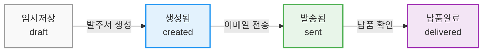

# 발주서 상태 관리 시스템 개선 계획

## 목차
1. [현재 상황 분석](#현재-상황-분석)
2. [구체적인 개선 계획](#구체적인-개선-계획)
3. [워크플로우 정리](#워크플로우-정리)
4. [예상 작업 시간](#예상-작업-시간)

## 현재 상황 분석

### 1. 데이터베이스 구조
현재 시스템은 **이중 상태 시스템**을 운영 중입니다:

| 필드명 | 용도 | 가능한 값 |
|--------|------|-----------|
| `status` | 레거시 호환성 | draft, pending, approved, sent, completed |
| `orderStatus` | 발주 상태 | draft, created, sent, delivered |
| `approvalStatus` | 승인 상태 | not_required, pending, approved, rejected |

### 2. 현재 시스템의 문제점
- ❌ 임시저장(draft) 상태에서도 PDF 미리보기와 이메일 전송이 가능
- ❌ 발주서 생성 버튼이 없어 상태 전환이 불명확
- ❌ PDF는 bulk create 시에만 자동 생성되고, 개별 발주서는 미리보기만 가능
- ❌ 상태별 권한 관리가 명확하지 않음

## 구체적인 개선 계획

### 1. 백엔드 개선

#### A. 새로운 API 엔드포인트 추가

##### 발주서 생성 엔드포인트
```typescript
POST /api/orders/:id/create-order
```

**기능:**
- draft 상태 검증
- PDF 생성 (PDFGenerationService 활용)
- 첨부파일 DB 등록
- orderStatus를 'created'로 변경
- orderHistory에 기록

**요청/응답 예시:**
```json
// Request
POST /api/orders/123/create-order

// Response
{
  "success": true,
  "orderId": 123,
  "orderNumber": "PO-2025-00123",
  "status": "created",
  "pdfUrl": "/uploads/pdf/2025/01/PO_2025_00123.pdf",
  "message": "발주서가 성공적으로 생성되었습니다."
}
```

#### B. 기존 API 수정

##### GET /api/orders/:id 수정
```typescript
// 응답에 권한 정보 추가
{
  ...orderData,
  "permissions": {
    "canEdit": boolean,
    "canCreateOrder": boolean,
    "canGeneratePDF": boolean,
    "canSendEmail": boolean,
    "canApprove": boolean
  }
}
```

##### PDF 생성 서비스 개선
- 워터마크 제거 옵션 추가
- 정식 발주서 생성 시 워터마크 없는 PDF 생성
- 미리보기 시에만 워터마크 표시

### 2. 프론트엔드 개선

#### A. order-detail-professional.tsx 수정

##### 상태별 액션 버튼 표시 로직
```typescript
// 상태별 버튼 표시 규칙
const buttonVisibility = {
  draft: {
    edit: true,
    createOrder: true,
    pdfPreview: false,
    sendEmail: false
  },
  created: {
    edit: true,
    createOrder: false,
    pdfPreview: true,
    sendEmail: true
  },
  sent: {
    edit: false,
    createOrder: false,
    pdfPreview: true,
    sendEmail: false,
    emailHistory: true
  }
};
```

##### 새로운 상태 표시 UI
```tsx
// 임시저장 상태 경고 배너
{order.orderStatus === 'draft' && (
  <Alert className="mb-4 bg-yellow-50 border-yellow-200">
    <AlertCircle className="h-4 w-4" />
    <AlertDescription>
      이 발주서는 아직 임시저장 상태입니다. 
      "발주서 생성" 버튼을 클릭하여 정식 발주서로 전환하세요.
    </AlertDescription>
  </Alert>
)}
```

#### B. orders-professional-fast.tsx 수정

##### 목록 페이지 액션 아이콘 조건부 렌더링
```tsx
// 액션 컬럼 아이콘 표시 로직
const renderActions = (order) => {
  return (
    <>
      {/* 수정 - draft, created 상태에서만 표시 */}
      {['draft', 'created'].includes(order.orderStatus) && (
        <IconButton icon={Edit} onClick={() => handleEdit(order)} />
      )}
      
      {/* PDF 보기 - created 이상 상태에서만 표시 */}
      {['created', 'sent', 'delivered'].includes(order.orderStatus) && (
        <IconButton icon={FileText} onClick={() => handlePDFView(order)} />
      )}
      
      {/* 이메일 - created 상태에서만 표시 */}
      {order.orderStatus === 'created' && (
        <IconButton icon={Mail} onClick={() => handleEmail(order)} />
      )}
    </>
  );
};
```

### 3. UI/UX 개선 사항

#### A. 발주서 상세보기 화면

##### 1. 상태 표시 강화
- 임시저장 상태 시 상단에 노란색 경고 배너 표시
- "발주서를 생성하여 정식 발주서로 전환하세요" 안내 메시지
- 상태 변경 히스토리 타임라인 표시

##### 2. 버튼 배치 및 표시

| 상태 | 표시되는 버튼 |
|------|--------------|
| 임시저장 (draft) | [수정] [발주서 생성] |
| 생성됨 (created) | [수정] [PDF 다운로드] [이메일 전송] |
| 발송됨 (sent) | [PDF 다운로드] [이메일 기록] |
| 납품완료 (delivered) | [PDF 다운로드] [이메일 기록] |

##### 3. 첨부파일 섹션 개선
```tsx
// 첨부파일 섹션 구조
<Card>
  <CardHeader>
    <h3>첨부파일</h3>
  </CardHeader>
  <CardContent>
    {/* 생성된 PDF 파일 */}
    {order.pdfAttachment && (
      <FileItem
        name="발주서 PDF"
        size={order.pdfAttachment.size}
        createdAt={order.pdfAttachment.createdAt}
        createdBy={order.pdfAttachment.createdBy}
        onDownload={() => handleDownloadPDF()}
      />
    )}
    
    {/* 기타 첨부파일 */}
    {order.attachments.map(attachment => (
      <FileItem key={attachment.id} {...attachment} />
    ))}
  </CardContent>
</Card>
```

#### B. 발주서 목록 화면

##### 1. 상태 컬럼 개선
- 발주 상태와 승인 상태 분리 표시
- 색상 코드화:
  - draft (회색): 임시저장
  - created (파란색): 발주서 생성됨
  - sent (초록색): 발송 완료
  - delivered (보라색): 납품 완료

##### 2. 액션 아이콘 조건부 표시
- 상태에 따른 아이콘 활성화/비활성화
- 비활성 아이콘은 회색 처리
- 호버 시 툴팁으로 사용 가능 여부 안내

## 워크플로우 정리

### 발주서 생명주기



### 상태별 가능한 액션

| 현재 상태 | 가능한 액션 | 다음 상태 |
|----------|------------|-----------|
| draft | 수정, 삭제, **발주서 생성** | created |
| created | 수정, PDF 다운로드, **이메일 전송** | sent |
| sent | PDF 다운로드, 이메일 기록 보기 | delivered |
| delivered | PDF 다운로드, 이메일 기록 보기 | - |

## 데이터 마이그레이션

### 1. 기존 데이터 매핑
```sql
-- 기존 status를 새로운 orderStatus로 매핑
UPDATE purchase_orders
SET order_status = CASE
    WHEN status = 'draft' THEN 'draft'
    WHEN status = 'approved' THEN 'created'
    WHEN status = 'sent' THEN 'sent'
    WHEN status = 'completed' THEN 'delivered'
    ELSE order_status
END
WHERE order_status IS NULL;
```

### 2. PDF 생성 배치 작업
```typescript
// PDF 없는 기존 발주서에 대한 PDF 생성
async function generateMissingPDFs() {
  const ordersWithoutPDF = await getOrdersWithoutPDF();
  
  for (const order of ordersWithoutPDF) {
    if (order.orderStatus !== 'draft') {
      await PDFGenerationService.generatePurchaseOrderPDF(
        order.id,
        order,
        'system'
      );
    }
  }
}
```

## 테스트 시나리오

### 1. 단위 테스트
- [ ] draft 상태에서 PDF/이메일 버튼 숨김 확인
- [ ] 발주서 생성 API 호출 테스트
- [ ] 상태 전환 로직 테스트
- [ ] 권한 체크 테스트

### 2. 통합 테스트
- [ ] 발주서 생성 전체 플로우 테스트
- [ ] PDF 생성 및 저장 확인
- [ ] 이메일 발송 후 상태 변경 확인
- [ ] 목록 페이지 아이콘 표시 테스트

### 3. E2E 테스트
- [ ] 사용자 시나리오별 테스트
  - 임시저장 → 발주서 생성 → 이메일 전송
  - 발주서 수정 → 재생성 → 발송
  - 권한별 버튼 표시 확인

## 예상 작업 시간

| 작업 항목 | 예상 시간 | 담당자 |
|----------|----------|--------|
| 백엔드 API 개발 | 2시간 | Backend |
| 프론트엔드 UI 수정 | 3시간 | Frontend |
| 데이터 마이그레이션 | 1시간 | Backend |
| 테스트 작성 및 실행 | 1시간 | QA |
| 디버깅 및 최적화 | 1시간 | Full Stack |
| **총 예상 시간** | **8시간** | - |

## 롤백 계획

만약 문제가 발생할 경우:

1. **데이터베이스 롤백**
   - 마이그레이션 이전 백업으로 복원
   - orderStatus 필드를 NULL로 리셋

2. **코드 롤백**
   - Git 이전 커밋으로 revert
   - 긴급 패치 배포

3. **임시 조치**
   - Feature flag로 새 기능 비활성화
   - 레거시 status 필드만 사용하도록 전환

## 참고 문서
- [데이터베이스 스키마](./shared/schema.ts)
- [PDF 생성 서비스](./server/services/pdf-generation-service.ts)
- [발주서 API 라우트](./server/routes/orders.ts)
- [발주서 상세 페이지](./client/src/pages/order-detail-professional.tsx)