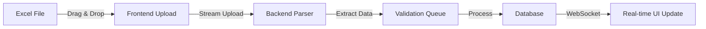
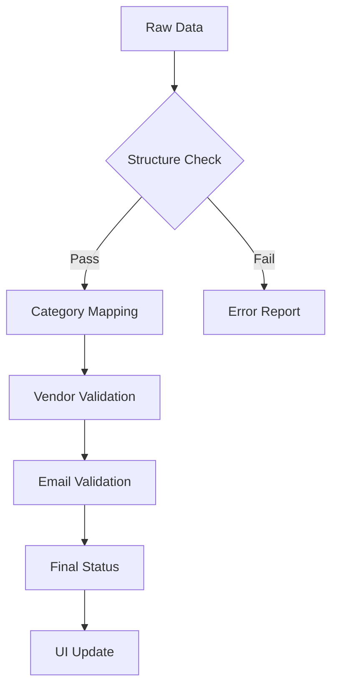
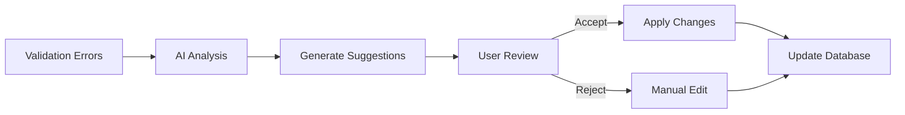

# Excel 업로드 시스템 개선 계획
> 데이터 무결성을 유지하면서 사용자 경험을 극적으로 개선하는 통합 Excel 업로드 시스템

## 📋 Executive Summary

현재 시스템의 복잡한 4단계 프로세스를 **원스텝 스마트 업로드 시스템**으로 전환합니다. 
AI 기반 자동 검증과 인라인 편집을 통해 사용자 작업량을 90% 감소시키면서도 데이터 정확도는 향상시킵니다.

### 핵심 개선 목표
- **복잡도 감소**: 4단계 → 1단계 프로세스
- **자동화율**: 90% 이상 자동 처리
- **오류 감소**: AI 기반 사전 검증으로 오류율 80% 감소
- **작업 시간**: 평균 15분 → 3분으로 단축

## 🏗️ 시스템 아키텍처

### 기술 스택

#### Frontend
- **React 18** + TypeScript
- **TanStack Query v5** - 서버 상태 관리
- **Zustand** - 클라이언트 상태 관리
- **React Hook Form** + Zod - 폼 검증
- **@tanstack/react-table** - 고성능 테이블
- **Framer Motion** - 애니메이션
- **React Dropzone** - 파일 업로드

#### Backend
- **Express** + TypeScript
- **PostgreSQL** + Drizzle ORM
- **Bull Queue** - 백그라운드 작업
- **Redis** - 캐싱 및 세션
- **ExcelJS** - Excel 처리
- **OpenAI API** - AI 자동 수정

#### Infrastructure
- **Docker** - 컨테이너화
- **GitHub Actions** - CI/CD
- **Vercel** - 프론트엔드 배포
- **AWS S3** - 파일 저장

### 시스템 구성도

```
┌─────────────────────────────────────────────────────────┐
│                    Frontend (React)                       │
├─────────────────────────────────────────────────────────┤
│  ┌─────────────┐  ┌──────────────┐  ┌──────────────┐  │
│  │  DropZone   │  │ SmartTable   │  │ Validation   │  │
│  │  Component  │  │   Component  │  │   Panel      │  │
│  └──────┬──────┘  └──────┬───────┘  └──────┬───────┘  │
│         │                 │                  │          │
│  ┌──────▼─────────────────▼──────────────────▼──────┐  │
│  │          Excel Upload State Manager              │  │
│  │              (Zustand + React Query)             │  │
│  └───────────────────────┬──────────────────────────┘  │
└──────────────────────────┼──────────────────────────────┘
                          │
                    WebSocket / REST API
                          │
┌──────────────────────────┼──────────────────────────────┐
│                    Backend (Express)                     │
├──────────────────────────┴──────────────────────────────┤
│  ┌─────────────┐  ┌──────────────┐  ┌──────────────┐  │
│  │   Upload    │  │  Validation  │  │      AI      │  │
│  │   Handler   │  │   Service    │  │   Service    │  │
│  └──────┬──────┘  └──────┬───────┘  └──────┬───────┘  │
│         │                 │                  │          │
│  ┌──────▼─────────────────▼──────────────────▼──────┐  │
│  │              Background Job Queue                │  │
│  │                  (Bull + Redis)                  │  │
│  └───────────────────────┬──────────────────────────┘  │
│                          │                              │
│  ┌───────────────────────▼──────────────────────────┐  │
│  │              PostgreSQL Database                 │  │
│  └──────────────────────────────────────────────────┘  │
└──────────────────────────────────────────────────────────┘
```

## 🎯 구현 마일스톤

### Phase 1: Foundation (Week 1-2)
- [ ] 백엔드 API 아키텍처 설계
- [ ] 데이터베이스 스키마 확장
- [ ] 기본 파일 업로드 인프라 구축
- [ ] WebSocket 연결 설정

### Phase 2: Smart Validation (Week 3-4)
- [ ] 자동 카테고리 매핑 엔진
- [ ] 거래처 검증 서비스
- [ ] 이메일 유효성 검사
- [ ] 중복 감지 알고리즘

### Phase 3: UI Components (Week 5-6)
- [ ] DropZone 컴포넌트
- [ ] SmartTable 인라인 편집
- [ ] ValidationPanel 상태 표시
- [ ] AutoComplete 드롭다운

### Phase 4: AI Integration (Week 7-8)
- [ ] OpenAI API 연동
- [ ] 자동 수정 제안 엔진
- [ ] 학습 데이터 수집 시스템
- [ ] 정확도 개선 피드백 루프

### Phase 5: Optimization (Week 9-10)
- [ ] 성능 최적화
- [ ] 에러 핸들링 강화
- [ ] 사용성 테스트
- [ ] 문서화 및 배포

## 🔄 데이터 플로우

### 1. 파일 업로드 플로우


### 2. 검증 플로우


### 3. AI 자동 수정 플로우


## 📊 성능 목표

### 처리 속도
- 파일 업로드: < 2초 (10MB 기준)
- 초기 검증: < 3초 (100개 항목)
- AI 자동 수정: < 5초
- 전체 프로세스: < 1분

### 확장성
- 동시 업로드: 100명
- 최대 파일 크기: 50MB
- 최대 항목 수: 10,000개
- 응답 시간: < 100ms (95 percentile)

## 🔒 보안 고려사항

### 파일 보안
- 바이러스 스캔
- 파일 타입 검증
- 크기 제한
- 샌드박스 처리

### 데이터 보안
- 입력 검증
- SQL Injection 방지
- XSS 방지
- 민감 정보 암호화

### 권한 관리
- Role-based Access Control
- 세션 관리
- API Rate Limiting
- Audit Logging

## 📈 성공 지표 (KPIs)

### 사용성 지표
- 평균 작업 완료 시간: 3분 이하
- 첫 번째 시도 성공률: 80% 이상
- 사용자 만족도: 4.5/5 이상

### 기술 지표
- 시스템 가용성: 99.9%
- 평균 응답 시간: 200ms 이하
- 오류율: 0.1% 이하
- 자동화율: 90% 이상

### 비즈니스 지표
- 발주서 처리량: 300% 증가
- 오류로 인한 재작업: 80% 감소
- 운영 비용: 50% 절감

## 🚀 배포 전략

### 단계별 롤아웃
1. **Alpha** (Week 10): 내부 테스트팀
2. **Beta** (Week 11): 선택된 파워 유저
3. **Canary** (Week 12): 10% 사용자
4. **General Availability** (Week 13): 전체 배포

### Feature Flags
```typescript
const features = {
  smartValidation: true,
  aiAutoCorrection: true,
  inlineEditing: true,
  realtimeSync: true,
  batchProcessing: false // Phase 2
};
```

## 📝 리스크 관리

### 기술적 리스크
| 리스크 | 영향도 | 확률 | 대응 방안 |
|--------|--------|------|-----------|
| AI API 장애 | 높음 | 중간 | Fallback to rule-based |
| 대용량 파일 처리 실패 | 높음 | 낮음 | 청크 처리 구현 |
| 실시간 동기화 지연 | 중간 | 중간 | 배치 처리 옵션 |

### 사업적 리스크
| 리스크 | 영향도 | 확률 | 대응 방안 |
|--------|--------|------|-----------|
| 사용자 적응 어려움 | 중간 | 중간 | 튜토리얼 및 교육 |
| 레거시 시스템 호환성 | 높음 | 낮음 | 듀얼 모드 운영 |
| 데이터 마이그레이션 | 높음 | 낮음 | 단계적 전환 |

## 🔄 향후 계획 (Phase 2)

### 추가 기능
- **Batch Processing**: 대량 파일 동시 처리
- **Template Learning**: 사용자별 템플릿 학습
- **Collaboration**: 실시간 공동 편집
- **Mobile Support**: 모바일 앱 개발
- **API Integration**: 외부 ERP 시스템 연동

### 기술 개선
- **Machine Learning**: 자체 ML 모델 구축
- **Blockchain**: 발주서 무결성 보장
- **Edge Computing**: 로컬 처리 옵션
- **GraphQL**: API 효율성 개선

## 📚 참고 문서

- [IMPLEMENTATION_TASKS.md](./IMPLEMENTATION_TASKS.md) - 상세 구현 태스크
- [UI_COMPONENTS_SPEC.md](./UI_COMPONENTS_SPEC.md) - UI 컴포넌트 명세
- [API_DOCUMENTATION.md](./API_DOCUMENTATION.md) - API 문서
- [TESTING_STRATEGY.md](./TESTING_STRATEGY.md) - 테스트 전략

---

*Last Updated: 2024-09-04*
*Version: 1.0.0*
*Author: IKJIN PO Management Team*