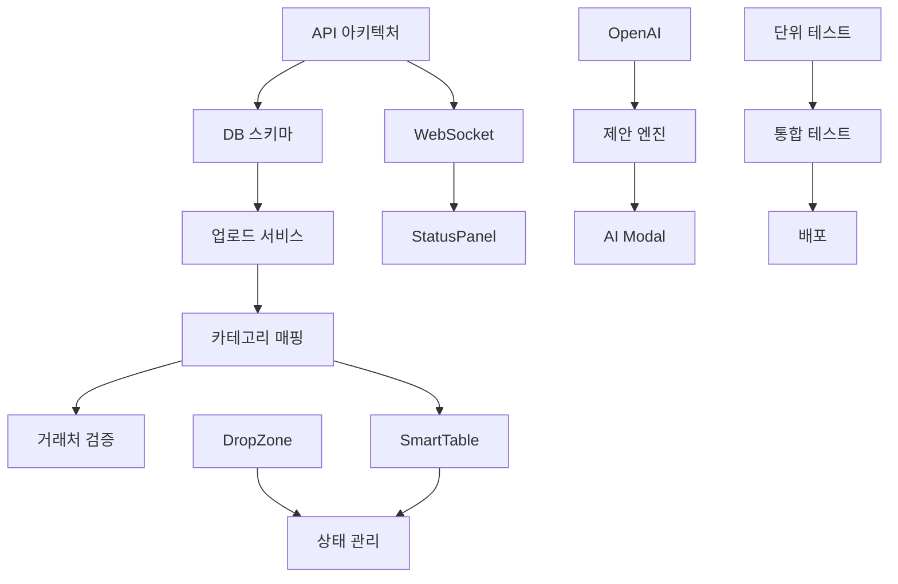

# Excel 업로드 시스템 구현 태스크

## 📋 Task Overview

총 **35개**의 구현 태스크를 **5개 Phase**로 구분하여 체계적으로 진행합니다.

### 진행 상태 표시
- ⬜ Not Started
- 🟦 In Progress
- ✅ Completed
- ⚠️ Blocked
- ❌ Cancelled

---

## Phase 1: Backend Foundation (Week 1-2)

### Task 1.1: API 아키텍처 설계
⬜ **Status**: Not Started  
**Priority**: P0 (Critical)  
**Estimated**: 8 hours  
**Assignee**: Backend Lead

#### Checklist:
- [ ] RESTful API 엔드포인트 설계
- [ ] WebSocket 이벤트 정의
- [ ] Request/Response 스키마 작성
- [ ] Error 코드 체계 정의
- [ ] API 버저닝 전략 수립

#### Implementation Details:
```typescript
// API 엔드포인트 구조
POST   /api/excel/upload/smart      // 스마트 업로드
GET    /api/excel/validation/:id    // 검증 상태 조회
PATCH  /api/excel/correction/:id    // 수정 사항 적용
POST   /api/excel/ai/suggest        // AI 제안 생성
WS     /excel/realtime              // 실시간 업데이트
```

---

### Task 1.2: 데이터베이스 스키마 확장
⬜ **Status**: Not Started  
**Priority**: P0  
**Estimated**: 6 hours  
**Dependencies**: Task 1.1

#### Checklist:
- [ ] validation_sessions 테이블 생성
- [ ] validation_results 테이블 생성
- [ ] ai_suggestions 테이블 생성
- [ ] vendor_mappings 캐시 테이블
- [ ] category_mappings 캐시 테이블
- [ ] 인덱스 최적화

#### SQL Schema:
```sql
-- validation_sessions 테이블
CREATE TABLE validation_sessions (
  id UUID PRIMARY KEY,
  user_id INTEGER REFERENCES users(id),
  file_name VARCHAR(255),
  file_size INTEGER,
  total_items INTEGER,
  valid_items INTEGER,
  status VARCHAR(50),
  created_at TIMESTAMP,
  completed_at TIMESTAMP
);

-- validation_results 테이블
CREATE TABLE validation_results (
  id UUID PRIMARY KEY,
  session_id UUID REFERENCES validation_sessions(id),
  row_index INTEGER,
  field_name VARCHAR(100),
  original_value TEXT,
  validated_value TEXT,
  validation_status VARCHAR(20),
  error_message TEXT,
  suggestion TEXT
);
```

---

### Task 1.3: 파일 업로드 서비스 구현
⬜ **Status**: Not Started  
**Priority**: P0  
**Estimated**: 12 hours  
**Dependencies**: Task 1.2

#### Checklist:
- [ ] Multer 설정 및 파일 크기 제한
- [ ] Stream 처리 로직 구현
- [ ] 임시 파일 관리 시스템
- [ ] 바이러스 스캔 통합
- [ ] S3 업로드 옵션

#### Code Structure:
```typescript
// services/smart-upload-service.ts
class SmartUploadService {
  async handleUpload(file: Express.Multer.File): Promise<UploadResult>
  async parseExcel(buffer: Buffer): Promise<ParsedData>
  async validateStructure(data: ParsedData): Promise<ValidationResult>
  async storeSession(result: ValidationResult): Promise<string>
}
```

---

### Task 1.4: WebSocket 실시간 통신 구현
⬜ **Status**: Not Started  
**Priority**: P1  
**Estimated**: 8 hours  
**Dependencies**: Task 1.1

#### Checklist:
- [ ] Socket.io 서버 설정
- [ ] 인증 미들웨어 구현
- [ ] Room 기반 세션 관리
- [ ] 이벤트 핸들러 구현
- [ ] 재연결 로직

---

### Task 1.5: Redis 캐싱 레이어 구축
⬜ **Status**: Not Started  
**Priority**: P1  
**Estimated**: 6 hours

#### Checklist:
- [ ] Redis 연결 설정
- [ ] 캐싱 전략 구현
- [ ] TTL 정책 설정
- [ ] 캐시 무효화 로직
- [ ] 모니터링 설정

---

## Phase 2: Smart Validation Engine (Week 3-4)

### Task 2.1: 카테고리 자동 매핑 엔진
⬜ **Status**: Not Started  
**Priority**: P0  
**Estimated**: 16 hours  
**Dependencies**: Task 1.3

#### Checklist:
- [ ] 카테고리 매핑 알고리즘 구현
- [ ] Fuzzy matching 로직
- [ ] 학습 데이터 수집 시스템
- [ ] 정확도 측정 메트릭
- [ ] Fallback 규칙 엔진

#### Algorithm Design:
```typescript
interface CategoryMapper {
  // 텍스트 기반 매칭
  textMatch(itemName: string): CategorySuggestion[]
  
  // 과거 데이터 기반 학습
  learnFromHistory(mappings: HistoricalMapping[]): void
  
  // 신뢰도 기반 자동 적용
  autoApply(suggestion: CategorySuggestion): boolean
}
```

---

### Task 2.2: 거래처 검증 서비스
⬜ **Status**: Not Started  
**Priority**: P0  
**Estimated**: 12 hours  
**Dependencies**: Task 2.1

#### Checklist:
- [ ] Levenshtein distance 구현
- [ ] 거래처 DB 검색 최적화
- [ ] 유사도 임계값 설정
- [ ] 신규 거래처 등록 플로우
- [ ] 거래처 정보 자동 완성

---

### Task 2.3: 이메일 유효성 검사기
⬜ **Status**: Not Started  
**Priority**: P1  
**Estimated**: 4 hours

#### Checklist:
- [ ] 정규식 검증
- [ ] DNS MX 레코드 확인
- [ ] 일반적인 오타 패턴 수정
- [ ] 도메인 화이트리스트
- [ ] Bounce 이력 체크

---

### Task 2.4: 중복 감지 알고리즘
⬜ **Status**: Not Started  
**Priority**: P1  
**Estimated**: 8 hours

#### Checklist:
- [ ] Hash 기반 중복 체크
- [ ] 유사 항목 그룹화
- [ ] 병합 규칙 정의
- [ ] 충돌 해결 전략
- [ ] 사용자 확인 플로우

---

### Task 2.5: 비즈니스 규칙 검증기
⬜ **Status**: Not Started  
**Priority**: P1  
**Estimated**: 10 hours

#### Checklist:
- [ ] 금액 한도 체크
- [ ] 날짜 유효성 검증
- [ ] 필수 필드 검증
- [ ] 프로젝트 권한 체크
- [ ] 커스텀 규칙 엔진

---

## Phase 3: Frontend Components (Week 5-6)

### Task 3.1: SmartDropZone 컴포넌트
⬜ **Status**: Not Started  
**Priority**: P0  
**Estimated**: 8 hours

#### Checklist:
- [ ] React Dropzone 통합
- [ ] 파일 미리보기
- [ ] 진행률 표시
- [ ] 에러 처리 UI
- [ ] 다중 파일 지원

#### Component Structure:
```tsx
interface SmartDropZoneProps {
  onFileUpload: (file: File) => Promise<void>
  maxSize?: number
  acceptedFormats?: string[]
  showPreview?: boolean
}

const SmartDropZone: React.FC<SmartDropZoneProps> = () => {
  // Drag & Drop 로직
  // 파일 검증
  // 업로드 상태 관리
}
```

---

### Task 3.2: ValidationStatusPanel 컴포넌트
⬜ **Status**: Not Started  
**Priority**: P0  
**Estimated**: 6 hours

#### Checklist:
- [ ] 실시간 상태 업데이트
- [ ] 신호등 시각화
- [ ] 상세 통계 표시
- [ ] 필터링 옵션
- [ ] 애니메이션 효과

---

### Task 3.3: SmartTable 인라인 편집기
⬜ **Status**: Not Started  
**Priority**: P0  
**Estimated**: 16 hours

#### Checklist:
- [ ] TanStack Table 통합
- [ ] 인라인 편집 셀
- [ ] 자동 완성 드롭다운
- [ ] 실시간 검증
- [ ] Undo/Redo 기능
- [ ] 가상 스크롤링

---

### Task 3.4: AutoCompleteInput 컴포넌트
⬜ **Status**: Not Started  
**Priority**: P1  
**Estimated**: 8 hours

#### Checklist:
- [ ] Fuzzy search 구현
- [ ] Debounced 검색
- [ ] 키보드 네비게이션
- [ ] 최근 선택 기록
- [ ] 로딩 상태 표시

---

### Task 3.5: AICorrectionsModal 컴포넌트
⬜ **Status**: Not Started  
**Priority**: P1  
**Estimated**: 10 hours

#### Checklist:
- [ ] 수정 제안 목록
- [ ] 선택적 적용
- [ ] 비교 뷰
- [ ] 수정 이유 표시
- [ ] 일괄 적용 옵션

---

### Task 3.6: 상태 관리 시스템 구축
⬜ **Status**: Not Started  
**Priority**: P0  
**Estimated**: 12 hours  
**Dependencies**: Task 3.1, 3.2, 3.3

#### Checklist:
- [ ] Zustand store 설계
- [ ] React Query 통합
- [ ] Optimistic updates
- [ ] 에러 상태 관리
- [ ] 로컬 스토리지 동기화

---

## Phase 4: AI Integration (Week 7-8)

### Task 4.1: OpenAI API 통합
⬜ **Status**: Not Started  
**Priority**: P0  
**Estimated**: 8 hours

#### Checklist:
- [ ] API 키 관리
- [ ] Rate limiting
- [ ] 프롬프트 엔지니어링
- [ ] 응답 파싱
- [ ] 에러 핸들링

#### Prompt Template:
```typescript
const generatePrompt = (data: ValidationError[]) => `
발주서 데이터에서 다음 오류들을 수정해주세요:
1. 거래처명 오타 및 정식 명칭 제안
2. 카테고리 자동 분류
3. 이메일 주소 수정
4. 날짜 형식 정규화

오류 데이터:
${JSON.stringify(data)}

JSON 형식으로 수정 제안을 반환해주세요.
`;
```

---

### Task 4.2: 자동 수정 제안 엔진
⬜ **Status**: Not Started  
**Priority**: P0  
**Estimated**: 12 hours  
**Dependencies**: Task 4.1

#### Checklist:
- [ ] 제안 생성 로직
- [ ] 신뢰도 점수 계산
- [ ] 우선순위 정렬
- [ ] 배치 처리
- [ ] 제안 저장 및 캐싱

---

### Task 4.3: 학습 데이터 수집 시스템
⬜ **Status**: Not Started  
**Priority**: P1  
**Estimated**: 8 hours

#### Checklist:
- [ ] 사용자 선택 추적
- [ ] 수정 패턴 분석
- [ ] 데이터 익명화
- [ ] 학습 데이터 저장
- [ ] 모델 재학습 트리거

---

### Task 4.4: 정확도 모니터링 대시보드
⬜ **Status**: Not Started  
**Priority**: P2  
**Estimated**: 6 hours

#### Checklist:
- [ ] 정확도 메트릭 수집
- [ ] 차트 시각화
- [ ] 오류 패턴 분석
- [ ] 개선 추세 표시
- [ ] 알림 설정

---

## Phase 5: Testing & Optimization (Week 9-10)

### Task 5.1: 단위 테스트 작성
⬜ **Status**: Not Started  
**Priority**: P0  
**Estimated**: 16 hours

#### Checklist:
- [ ] Backend 서비스 테스트
- [ ] Frontend 컴포넌트 테스트
- [ ] 검증 로직 테스트
- [ ] AI 제안 테스트
- [ ] 테스트 커버리지 80% 이상

#### Test Categories:
```typescript
// 테스트 구조
describe('SmartUploadService', () => {
  test('파일 업로드 성공 케이스')
  test('대용량 파일 처리')
  test('잘못된 형식 처리')
  test('동시 업로드 처리')
});

describe('ValidationEngine', () => {
  test('카테고리 매핑 정확도')
  test('거래처 검증 로직')
  test('이메일 유효성 검사')
  test('중복 감지 알고리즘')
});
```

---

### Task 5.2: 통합 테스트 작성
⬜ **Status**: Not Started  
**Priority**: P0  
**Estimated**: 12 hours  
**Dependencies**: Task 5.1

#### Checklist:
- [ ] E2E 테스트 시나리오
- [ ] API 통합 테스트
- [ ] WebSocket 테스트
- [ ] 동시성 테스트
- [ ] 성능 테스트

---

### Task 5.3: 성능 최적화
⬜ **Status**: Not Started  
**Priority**: P1  
**Estimated**: 16 hours

#### Checklist:
- [ ] 데이터베이스 쿼리 최적화
- [ ] 캐싱 전략 개선
- [ ] 프론트엔드 번들 최적화
- [ ] 이미지 및 리소스 최적화
- [ ] CDN 적용

#### Performance Targets:
```yaml
Metrics:
  - Initial Load: < 2s
  - Time to Interactive: < 3s
  - API Response: < 200ms (p95)
  - File Upload: < 1s/MB
  - Validation: < 50ms/item
```

---

### Task 5.4: 보안 강화
⬜ **Status**: Not Started  
**Priority**: P0  
**Estimated**: 10 hours

#### Checklist:
- [ ] 입력 검증 강화
- [ ] OWASP Top 10 체크
- [ ] Rate limiting 구현
- [ ] 파일 업로드 보안
- [ ] 권한 체크 강화
- [ ] 보안 감사 로깅

---

### Task 5.5: 에러 핸들링 및 로깅
⬜ **Status**: Not Started  
**Priority**: P1  
**Estimated**: 8 hours

#### Checklist:
- [ ] 전역 에러 핸들러
- [ ] 구조화된 로깅
- [ ] 에러 추적 시스템
- [ ] 사용자 친화적 에러 메시지
- [ ] 에러 복구 메커니즘

---

### Task 5.6: 사용자 문서 작성
⬜ **Status**: Not Started  
**Priority**: P1  
**Estimated**: 12 hours

#### Checklist:
- [ ] 사용자 가이드 작성
- [ ] API 문서 생성
- [ ] 비디오 튜토리얼
- [ ] FAQ 작성
- [ ] 문제 해결 가이드

---

### Task 5.7: 배포 파이프라인 구축
⬜ **Status**: Not Started  
**Priority**: P0  
**Estimated**: 8 hours

#### Checklist:
- [ ] CI/CD 파이프라인 설정
- [ ] 자동화 테스트 통합
- [ ] 스테이징 환경 구축
- [ ] 롤백 전략 수립
- [ ] 모니터링 설정

---

## 📊 Task Dependencies Graph



## 📈 진행 상황 대시보드

### Overall Progress
```
Phase 1: ⬜⬜⬜⬜⬜ 0% (0/5 tasks)
Phase 2: ⬜⬜⬜⬜⬜ 0% (0/5 tasks)
Phase 3: ⬜⬜⬜⬜⬜⬜ 0% (0/6 tasks)
Phase 4: ⬜⬜⬜⬜ 0% (0/4 tasks)
Phase 5: ⬜⬜⬜⬜⬜⬜⬜ 0% (0/7 tasks)

Total: 0/35 tasks completed (0%)
```

### Priority Distribution
- P0 (Critical): 14 tasks
- P1 (High): 15 tasks  
- P2 (Medium): 6 tasks

### Estimated Time
- Total: 350 hours
- Completed: 0 hours
- Remaining: 350 hours

## 🚦 Risk Items

### High Risk Tasks
1. **Task 2.1**: 카테고리 자동 매핑 - AI 정확도 의존
2. **Task 3.3**: SmartTable - 복잡한 상태 관리
3. **Task 4.1**: OpenAI 통합 - 외부 서비스 의존성

### Mitigation Strategies
- 각 고위험 태스크에 대한 Fallback 옵션 구현
- 점진적 기능 출시 (Feature Flag 활용)
- 충분한 테스트 및 스테이징 검증

## 📝 Notes

### 개발 원칙
1. **Progressive Enhancement**: 기본 기능부터 점진적 개선
2. **Fail Gracefully**: 오류 시 사용자 경험 유지
3. **Performance First**: 성능 최적화 우선
4. **User Feedback**: 실시간 피드백 제공

### 코드 컨벤션
- TypeScript strict mode 사용
- ESLint + Prettier 규칙 준수
- 100% 타입 안정성 보장
- 주석 및 문서화 필수

---

*Last Updated: 2024-09-04*  
*Version: 1.0.0*  
*Total Tasks: 35*  
*Estimated Completion: 10 weeks*