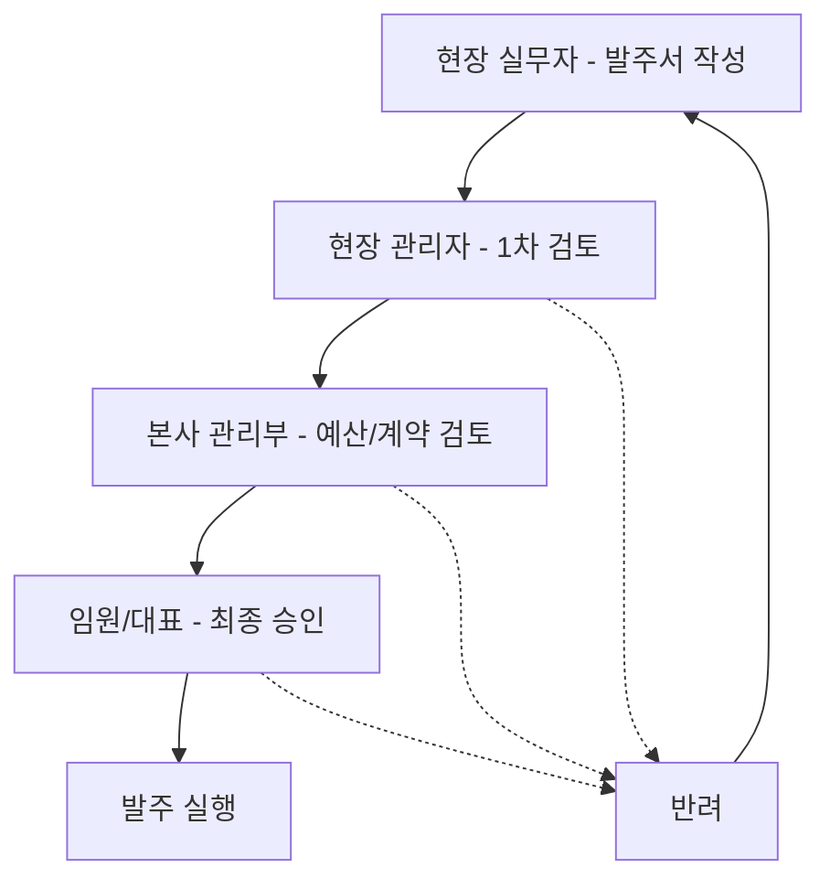

# 승인 관리 시스템 사용자 가이드

## 📋 목차
1. [시스템 개요](#시스템-개요)
2. [승인 관리 메뉴](#승인-관리-메뉴)
3. [승인 워크플로우](#승인-워크플로우)
4. [시스템 관리](#시스템-관리)
5. [알림 시스템](#알림-시스템)
6. [사용자 권한](#사용자-권한)
7. [FAQ](#faq)

---

## 🎯 시스템 개요

**IKJIN 발주 관리 시스템**의 승인 관리는 발주서의 체계적이고 투명한 승인 프로세스를 제공합니다.

### 주요 특징
- ✅ **다단계 승인 워크플로우**: 금액별, 카테고리별 맞춤형 승인 경로
- 📊 **실시간 진행 상황 추적**: 승인 단계별 진행 상태 시각화
- 🔔 **스마트 알림 시스템**: 브라우저 알림, 이메일 알림, 앱 내 알림
- 🎛️ **유연한 템플릿 관리**: 조직 구조에 맞는 승인 템플릿 생성
- 📈 **승인 통계 및 분석**: 승인 패턴 및 처리 시간 분석

---

## 🏛️ 승인 관리 메뉴

### 메뉴 접근 경로
**메인 메뉴 > 승인 관리** (`/approvals`)

### 권한 요구사항
다음 역할의 사용자만 접근 가능:
- `admin` (관리자)
- `executive` (임원)  
- `hq_management` (본사 관리부)
- `project_manager` (현장 관리자)

### 메뉴 구성

#### 1. 📊 통계 대시보드
```
┌─────────────┬─────────────┬─────────────┬─────────────┐
│ 승인 대기   │ 긴급 승인   │ 평균 대기일 │ 대기 금액   │
│ XX건        │ XX건        │ XX일        │ XXX,XXX원   │
└─────────────┴─────────────┴─────────────┴─────────────┘
```

#### 2. 🔍 필터 및 검색
- **발주번호 검색**: 특정 발주서 빠른 검색
- **상태 필터**: 승인 대기/완료/반려 등 상태별 필터링
- **보기 모드**: 테이블 뷰 / 카드 뷰 선택

#### 3. 📋 승인 대기 탭
**주요 기능:**
- ✅ **승인 처리**: 발주서 검토 후 승인/반려 결정
- 👁️ **상세 조회**: 발주서 전체 내용 및 첨부파일 확인
- ⏰ **지연 표시**: 3일 이상 대기 발주서 자동 표시
- 🔄 **실시간 업데이트**: 승인 상태 실시간 반영

**사용법:**
1. 승인 대기 목록에서 발주서 선택
2. 👁️ 버튼으로 상세 내용 확인
3. ✅ 버튼으로 승인 또는 ❌ 버튼으로 반려

#### 4. 📝 승인 내역 탭
- 승인/반려 완료된 발주서 이력 조회
- 처리일, 처리 결과, 승인자 정보 확인
- 검색 및 필터 기능으로 이력 관리

#### 5. 📖 승인 프로세스 가이드
상세한 승인 절차, 정책, 역할과 책임에 대한 안내

---

## 🔄 승인 워크플로우

### 기본 승인 프로세스



### 금액별 승인 권한

| 발주 금액 | 승인 권한 | 소요 시간 |
|-----------|-----------|-----------|
| 500만원 미만 | 현장 관리자 | 1-2일 |
| 500만원 ~ 3,000만원 | 본사 관리부 + 현장 관리자 | 2-3일 |
| 3,000만원 ~ 1억원 | 임원 승인 | 3-5일 |
| 1억원 이상 | 대표이사 승인 | 5-7일 |

### 승인 단계 세부사항

#### 1단계: 현장 실무자 (작성)
- 📝 발주 필요성 파악 및 규격 결정
- 📋 견적서 수집 (3사 이상 권장)
- 📅 납기 일정 검토
- 📎 필수 서류 첨부

#### 2단계: 현장 관리자 (검토/승인)
- ✅ 현장 필요성 및 시급성 검증
- 📊 현장 예산 범위 확인
- 🏗️ 공사 일정과의 부합성 검토
- 🔍 품질 및 안전 기준 검증

#### 3단계: 본사 관리부 (승인)
- 🏢 협력업체 신용도 확인
- 📜 계약 조건 및 법적 검토
- 💰 전체 프로젝트 예산 적정성 확인
- 📊 회계 처리 방안 검토

#### 4단계: 임원/대표 (최종 승인)
- 🎯 경영 전략 부합성 검토
- 💼 프로젝트 수익성 평가
- ⚖️ 리스크 요소 종합 판단
- ✍️ 최종 승인 결정

---

## ⚙️ 시스템 관리

### 접근 경로
**시스템 관리 > 승인 워크플로우** (`/admin` → 승인 워크플로우 탭)

### 워크플로우 설정 관리

#### 기본 워크플로우 설정
- **승인 모드 선택**
  - 직접 승인: 승인 절차 없이 즉시 발주
  - 단계별 승인: 순차적 승인 프로세스

- **직접 승인 권한 관리**
  - 역할별 직접 승인 권한 부여
  - 권한 범위 및 한도 설정

#### 승인 단계 템플릿 관리
- 금액별 승인 단계 템플릿 생성
- 역할별 승인 권한 설정
- 템플릿별 조건 및 설명 관리
- 템플릿 활성화/비활성화 제어

---

## 🔔 알림 시스템

### 알림 유형

#### 1. 📱 실시간 앱 내 알림
- 새로운 승인 요청 알림
- 승인/반려 결과 알림
- 지연 승인 경고 알림

#### 2. 🌐 브라우저 알림
- 우선순위 높은 승인 요청
- 긴급 승인 필요 알림
- 승인 기한 임박 알림

#### 3. 🔊 알림음
- 새 승인 요청 시 사운드 알림
- 사용자 설정으로 On/Off 가능

### 알림 센터 사용법

#### 접근 방법
- 헤더의 🔔 벨 아이콘 클릭
- 알림 개수 뱃지로 미읽은 알림 확인

#### 주요 기능
- **전체/미읽음 탭**: 알림 상태별 분류
- **알림 상세보기**: 관련 발주서로 바로 이동
- **일괄 읽음 처리**: 모든 알림 읽음 표시
- **알림 삭제**: 불필요한 알림 개별/전체 삭제

#### 설정 옵션
- **알림음 설정**: 사운드 알림 On/Off
- **브라우저 알림**: 권한 요청 및 활성화
- **알림 방식**: 알림 유형별 수신 설정

---

## 👥 사용자 권한

### 역할별 접근 권한

| 기능 | 현장실무자 | 현장관리자 | 본사관리부 | 임원 | 관리자 |
|------|:----------:|:----------:|:----------:|:----:|:------:|
| 발주서 작성 | ✅ | ✅ | ✅ | ✅ | ✅ |
| 승인 처리 | ❌ | ✅ | ✅ | ✅ | ✅ |
| 승인 관리 메뉴 | ❌ | ✅ | ✅ | ✅ | ✅ |
| 워크플로우 설정 | ❌ | ❌ | ❌ | 제한적 | ✅ |
| 시스템 관리 | ❌ | ❌ | ❌ | ❌ | ✅ |

### 권한별 주요 기능

#### 🔧 관리자 (Admin)
- 모든 승인 워크플로우 설정 및 수정
- 사용자 권한 관리
- 시스템 전체 설정 변경
- 승인 통계 및 분석 접근

#### 👔 임원 (Executive)
- 고액 발주 최종 승인
- 승인 정책 검토 및 제안
- 전사 승인 현황 모니터링
- 제한적 워크플로우 설정 변경

#### 🏢 본사 관리부 (HQ Management)
- 중간 단계 승인 처리
- 예산 및 계약 조건 검토
- 협력업체 신용도 평가
- 승인 통계 조회

#### 🏗️ 현장 관리자 (Project Manager)
- 현장 발주 1차 승인
- 긴급 발주 처리
- 현장별 승인 현황 관리
- 실무자 발주서 검토

---

## ❓ FAQ

### Q1. 승인 요청이 지연되고 있는데 어떻게 확인하나요?
**A1.** 승인 관리 메뉴에서 3일 이상 대기 중인 발주서는 자동으로 '지연' 뱃지가 표시됩니다. 통계 카드에서 전체 대기 현황을 확인할 수 있습니다.

### Q2. 긴급 발주는 어떻게 처리하나요?
**A2.** 현장 관리자가 발주서에 '긴급' 태그를 설정하면 우선 처리되며, 관련 승인자들에게 즉시 알림이 발송됩니다.

### Q3. 승인 권한이 없다고 나오는데 어떻게 해야 하나요?
**A3.** 시스템 관리자에게 역할 변경을 요청하거나, 현재 역할에 맞는 권한 범위 내에서 업무를 진행해주세요.

### Q4. 알림을 받지 못하고 있어요.
**A4.** 
- 브라우저 알림 권한이 허용되어 있는지 확인
- 알림 센터에서 알림음 설정이 활성화되어 있는지 확인
- 네트워크 연결 상태 점검

### Q5. 워크플로우 템플릿을 수정하고 싶어요.
**A5.** 관리자 권한이 있다면 시스템 관리 > 승인 워크플로우에서 템플릿 빌더를 사용하여 수정 가능합니다.

### Q6. 승인 처리 시 실수로 잘못 클릭했어요.
**A6.** 시스템 관리자에게 문의하여 승인 상태 변경을 요청하거나, 해당 발주서의 히스토리를 통해 되돌리기를 진행할 수 있습니다.

### Q7. 모바일에서도 승인 처리가 가능한가요?
**A7.** 네, 반응형 디자인으로 모바일 브라우저에서도 모든 승인 기능을 사용할 수 있습니다.

---

## 📞 지원 및 문의

### 기술 지원
- **시스템 오류**: 시스템 관리자에게 문의
- **권한 문제**: 인사/총무팀에 역할 변경 요청
- **사용법 문의**: 본 가이드 참조 또는 교육팀 문의

### 개선 제안
승인 시스템 개선 아이디어나 새로운 기능 요청은 시스템 관리자를 통해 개발팀에 전달해주세요.

---

*마지막 업데이트: 2024년 12월*  
*버전: v2.0*
