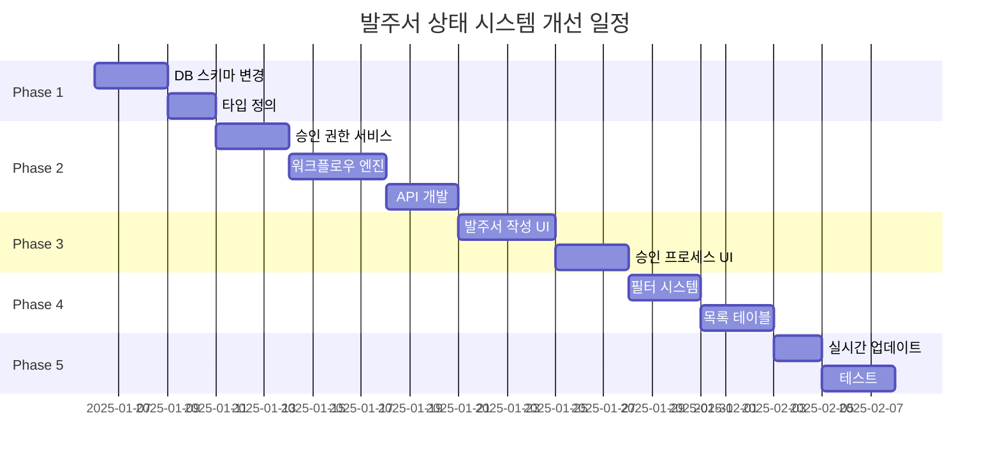

# 📋 발주서 상태 시스템 개선 구현 계획서

## 1. 개요

### 1.1 배경
현재 발주서 관리 시스템은 발주 프로세스와 승인 프로세스가 단일 상태 필드로 혼재되어 있어 사용자 혼란과 프로세스 관리의 어려움이 있습니다.

### 1.2 목표
- 발주 상태와 승인 상태를 분리하여 명확한 프로세스 관리
- 사용자 권한에 따른 직관적인 워크플로우 제공
- 실시간 상태 추적 및 자동 프로세스 진행

### 1.3 핵심 개선사항
1. **이중 상태 체계 도입**: 발주 상태(OrderStatus) + 승인 상태(ApprovalStatus)
2. **스마트 워크플로우**: 권한별 자동 프로세스 안내
3. **향상된 사용자 경험**: 직관적인 UI/UX 및 실시간 업데이트

---

## 2. 시스템 설계

### 2.1 상태 체계 정의

#### 발주 상태 (Order Status)
| 상태 | 코드 | 설명 | 전환 조건 |
|------|------|------|-----------|
| 임시저장 | `draft` | 작성 중인 발주서 | 초기 생성 시 |
| 발주서 생성 | `created` | 시스템에 정식 등록 | 발주서 생성 버튼 클릭 |
| 발송완료 | `sent` | 거래처에 이메일 발송 | 이메일 발송 성공 |
| 납품완료 | `delivered` | 자재 수령 및 검수 완료 | 납품 확인 처리 |

#### 승인 상태 (Approval Status)
| 상태 | 코드 | 설명 | 설정 조건 |
|------|------|------|-----------|
| 승인불필요 | `not_required` | 승인 과정 생략 | 직접 승인/소액/긴급 |
| 승인대기 | `pending` | 승인자 검토 중 | 승인 요청 제출 |
| 승인완료 | `approved` | 승인 완료 | 승인자 승인 처리 |
| 반려 | `rejected` | 승인 거부 | 승인자 반려 처리 |

#### 승인 불필요 사유 (Bypass Reasons)
```typescript
enum ApprovalBypassReason {
  AMOUNT_THRESHOLD = "amount_threshold",     // 금액 미달
  DIRECT_APPROVAL = "direct_approval",       // 직접 승인 권한
  AUTO_APPROVED = "auto_approved",          // 자동 승인 설정
  EMERGENCY = "emergency",                   // 긴급 발주
  REPEAT_ORDER = "repeat_order",           // 반복 발주
  EXCEL_AUTOMATION = "excel_automation"     // 엑셀 자동화
}
```

### 2.2 데이터베이스 스키마 변경

```sql
-- 새로운 Enum 타입 정의
CREATE TYPE order_status AS ENUM ('draft', 'created', 'sent', 'delivered');
CREATE TYPE approval_status AS ENUM ('not_required', 'pending', 'approved', 'rejected');

-- purchaseOrders 테이블 수정
ALTER TABLE purchase_orders 
  RENAME COLUMN status TO order_status;
  
ALTER TABLE purchase_orders 
  ADD COLUMN approval_status approval_status DEFAULT 'not_required',
  ADD COLUMN approval_bypass_reason TEXT,
  ADD COLUMN next_approver_id VARCHAR(255),
  ADD COLUMN approval_requested_at TIMESTAMP,
  ADD COLUMN delivered_at TIMESTAMP,
  ADD COLUMN delivered_by VARCHAR(255);

-- 승인 권한 테이블 확장
ALTER TABLE approval_authorities
  ADD COLUMN can_direct_approve BOOLEAN DEFAULT FALSE,
  ADD COLUMN direct_approve_limit DECIMAL(15,2);
```

---

## 3. 구현 작업 목록

### Phase 1: 데이터베이스 및 백엔드 기초 작업

#### Task Group 1.1: 데이터베이스 스키마 개선
- **1.1.1** Enum 타입 정의 추가
  - order_status enum 생성
  - approval_status enum 생성
  - Drizzle ORM 스키마 업데이트

- **1.1.2** purchaseOrders 테이블 수정
  - 컬럼 추가 및 수정
  - 인덱스 최적화
  - 제약 조건 설정

- **1.1.3** 데이터 마이그레이션
  - 기존 데이터 매핑 스크립트
  - 백업 및 롤백 플랜
  - 데이터 검증

#### Task Group 1.2: 타입 시스템 업데이트
- **1.2.1** TypeScript 타입 정의
  - shared/order-types.ts 수정
  - 인터페이스 업데이트
  - 유틸리티 타입 추가

### Phase 2: 백엔드 비즈니스 로직

#### Task Group 2.1: 승인 권한 서비스
```typescript
class ApprovalAuthorityService {
  // 권한 체크
  async checkAuthority(user: User, orderAmount: number): Promise<AuthorityCheck>
  
  // 직접 승인 가능 여부
  async canDirectApprove(user: User, orderAmount: number): boolean
  
  // 필요한 승인자 목록
  async getRequiredApprovers(orderAmount: number): Promise<Approver[]>
}
```

#### Task Group 2.2: 워크플로우 엔진
```typescript
class WorkflowEngine {
  // 다음 단계 자동 처리
  async processNextStep(orderId: string): Promise<void>
  
  // 상태 추적
  async trackWorkflowProgress(orderId: string): Promise<WorkflowStatus>
  
  // 알림 발송
  async sendNotifications(orderId: string, event: WorkflowEvent): Promise<void>
}
```

#### Task Group 2.3: API 엔드포인트
| 엔드포인트 | 메서드 | 설명 |
|-----------|--------|------|
| `/api/orders/check-approval-authority` | POST | 승인 권한 확인 |
| `/api/orders/create-with-workflow` | POST | 워크플로우 통합 생성 |
| `/api/orders/workflow-status/:id` | GET | 워크플로우 상태 조회 |
| `/api/orders/:id/confirm-delivery` | POST | 납품 확인 |

### Phase 3: 프론트엔드 - 발주서 작성 화면

#### Task Group 3.1: UI 컴포넌트
- **3.1.1** 통합 발주서 생성 버튼
  ```tsx
  <CreateOrderButton
    onClick={handleSmartCreate}
    userAuthority={authority}
    orderAmount={totalAmount}
  />
  ```

- **3.1.2** 승인 안내 모달
  ```tsx
  <ApprovalGuideModal
    requiredApprovers={approvers}
    estimatedTime={time}
    onProceed={handleProceed}
  />
  ```

#### Task Group 3.2: 워크플로우 시각화
- **3.2.1** 진행 상황 표시
- **3.2.2** 예상 시간 계산
- **3.2.3** 다음 단계 안내

### Phase 4: 프론트엔드 - 발주서 관리 화면

#### Task Group 4.1: 필터 시스템
```tsx
// 이중 상태 필터 컴포넌트
<DualStatusFilter>
  <FilterGroup label="발주 상태">
    <Checkbox value="draft">임시저장</Checkbox>
    <Checkbox value="created">발주서 생성</Checkbox>
    <Checkbox value="sent">발송완료</Checkbox>
    <Checkbox value="delivered">납품완료</Checkbox>
  </FilterGroup>
  
  <FilterGroup label="승인 상태">
    <Checkbox value="not_required">승인불필요</Checkbox>
    <Checkbox value="pending">승인대기</Checkbox>
    <Checkbox value="approved">승인완료</Checkbox>
    <Checkbox value="rejected">반려</Checkbox>
  </FilterGroup>
</DualStatusFilter>
```

#### Task Group 4.2: 목록 테이블 개선
- **4.2.1** 컬럼 구성
  - 이중 상태 뱃지
  - 진행도 표시
  - 담당자 정보

- **4.2.2** 상태별 액션
  ```typescript
  function getAvailableActions(order: Order): Action[] {
    // 발주 상태별 액션
    // 승인 상태별 액션
    // 사용자 권한별 액션
  }
  ```

### Phase 5: 실시간 업데이트

#### Task Group 5.1: WebSocket 구현
- **5.1.1** Socket.io 서버 설정
- **5.1.2** 클라이언트 연결 관리
- **5.1.3** 이벤트 핸들링

#### Task Group 5.2: 알림 시스템
- **5.2.1** 브라우저 알림
- **5.2.2** 인앱 토스트
- **5.2.3** 이메일 알림

---

## 4. 구현 일정

### 전체 일정: 6주 (30 영업일)



### 주차별 상세 계획

#### Week 1 (Day 1-5): 기반 구축
- Day 1-2: 데이터베이스 스키마 변경
- Day 3: 타입 시스템 업데이트
- Day 4-5: 마이그레이션 스크립트 작성

#### Week 2 (Day 6-10): 백엔드 핵심
- Day 6-7: 승인 권한 서비스
- Day 8-10: 워크플로우 엔진

#### Week 3 (Day 11-15): API 개발
- Day 11-12: 신규 API 엔드포인트
- Day 13-14: 기존 API 수정
- Day 15: API 테스트

#### Week 4 (Day 16-20): 발주서 작성 UI
- Day 16-17: 통합 생성 버튼
- Day 18-19: 승인 안내 모달
- Day 20: 워크플로우 UI

#### Week 5 (Day 21-25): 발주서 관리 UI
- Day 21-22: 필터 시스템
- Day 23-24: 목록 테이블
- Day 25: 모바일 반응형

#### Week 6 (Day 26-30): 마무리
- Day 26-27: 실시간 업데이트
- Day 28-29: 통합 테스트
- Day 30: 배포 준비

---

## 5. 리스크 관리

### 5.1 기술적 리스크
| 리스크 | 영향도 | 대응 방안 |
|--------|--------|-----------|
| 기존 데이터 마이그레이션 실패 | 높음 | 단계별 마이그레이션, 롤백 플랜 |
| 성능 저하 | 중간 | 인덱스 최적화, 캐싱 전략 |
| 브라우저 호환성 | 낮음 | 폴리필 적용, 점진적 기능 향상 |

### 5.2 비즈니스 리스크
| 리스크 | 영향도 | 대응 방안 |
|--------|--------|-----------|
| 사용자 적응 어려움 | 중간 | 단계적 배포, 사용자 교육 |
| 프로세스 복잡도 증가 | 중간 | 직관적 UI, 자동화 확대 |
| 기존 워크플로우 중단 | 높음 | 병렬 운영 기간, 점진적 전환 |

---

## 6. 성공 지표 (KPI)

### 6.1 정량적 지표
- **발주 처리 시간**: 현재 평균 2일 → 목표 4시간 (80% 단축)
- **승인 소요 시간**: 현재 평균 1일 → 목표 2시간 (90% 단축)
- **클릭 수**: 발주 완료까지 현재 8클릭 → 목표 3클릭 (62% 감소)
- **오류율**: 승인 누락/실수 현재 5% → 목표 0.5% (90% 감소)

### 6.2 정성적 지표
- 사용자 만족도 향상
- 프로세스 투명성 증가
- 의사결정 속도 향상
- 시스템 신뢰도 증가

---

## 7. 팀 구성 및 역할

### 7.1 개발팀
- **백엔드 개발자** (1명): DB 스키마, API, 비즈니스 로직
- **프론트엔드 개발자** (1명): UI 컴포넌트, 상태 관리
- **풀스택 개발자** (1명): 통합, 테스트, 배포

### 7.2 지원팀
- **UI/UX 디자이너**: 화면 설계, 사용성 검토
- **QA 엔지니어**: 테스트 계획, 품질 관리
- **프로젝트 매니저**: 일정 관리, 이해관계자 조율

---

## 8. 예산 및 리소스

### 8.1 개발 비용
- 인건비: 3명 × 6주 = 18 man-weeks
- 인프라: 개발/스테이징 서버
- 도구: 개발 도구 라이센스

### 8.2 운영 비용
- 서버 증설 (WebSocket 지원)
- 모니터링 도구
- 백업 스토리지

---

## 9. 다음 단계

### 9.1 즉시 실행 (Quick Win)
1. 데이터베이스 스키마 변경 준비
2. 프로토타입 개발
3. 사용자 피드백 수집

### 9.2 단계적 배포
1. **Phase 1**: 내부 테스트 (1주)
2. **Phase 2**: 파일럿 운영 (2주)
3. **Phase 3**: 전체 배포 (1주)

### 9.3 향후 확장
- AI 기반 승인 예측
- 자동 발주 시스템
- 공급망 통합 관리

---

## 10. 부록

### A. 데이터베이스 ERD
```
[purchaseOrders]
├── id (PK)
├── orderNumber
├── orderStatus ← 신규
├── approvalStatus ← 신규
├── approvalBypassReason ← 신규
├── nextApproverId ← 신규
├── deliveredAt ← 신규
└── deliveredBy ← 신규
```

### B. API 명세서
(별도 문서 참조)

### C. UI/UX 가이드라인
(별도 문서 참조)

---

**문서 버전**: 1.0  
**작성일**: 2025-01-04  
**작성자**: Development Team  
**승인자**: Project Manager  

---

이 계획서는 발주서 상태 시스템 개선을 위한 종합적인 구현 가이드입니다. 각 단계별 상세 구현은 해당 Task 실행 시 구체화됩니다.